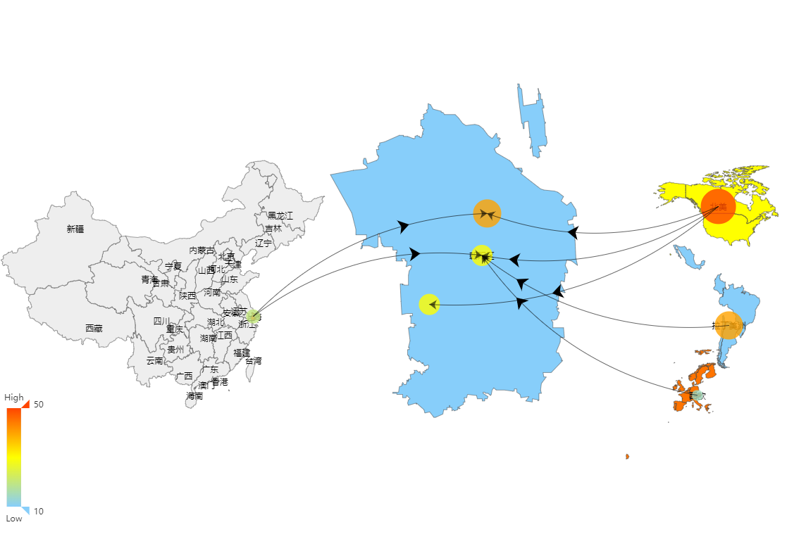

# 中国与自定义世界区域地图

地图是中国地图为中心，周围分布自定义的世界区块。中国地图粒度到省，世界区块为大洲。

世界区块的位置和缩放比例自定义。

## 使用说明
查看样例：运行index.html



## 实现方法

**修改百度官方echarts-4.0.4/echarts.js:**

在文件结尾添加：
```javascript
exports.geoFixFuncs = geoFixFuncs;
```

**编辑maps/china-world-area.js:**

定义需要加入地图的区块，以及组成区块的国家：
```javascript
var areaDefines = {
        '北美' : ['Canada', 'United States'],
        '拉丁美洲' : ['Mexico', 'Colombia','Chile', 'Brazil', 'Argentina'],
        '西欧' : ['Spain','Sweden','United Kingdom', 'Switzerland', 'Portugal', 'Norway',
                'Netherlands','Italy', 'Ireland','Greece','Austria', 'Belgium',
                'Denmark', 'Finland','France', 'Germany'],
    };
```

定义世界区块的位置和缩放比例，必要时修正区块中心点坐标：
坐标单位是经纬度。
```javascript
var positionSettings = {
        '北美' : { center: [150, 47], zoom: 0.2, centerOffset: [-50, 10]},
        '拉丁美洲' : { center: [152, 30], zoom: 0.2, centerOffset: [0, 30]},
        '西欧' : { center: [76, 50], zoom: 0.2},
    };
```


## 设计思路

**动态制作地图数据 :**

地图数据来源是标准的中国地图和世界地图。

用javascript对json数据进行处理，把世界地图的国家数据抽取出来，组合为区块，安插到中国地图数据中。

**利用百度地图geoFixFuncs接口调整区块 :**

Echarts在地图加载后有一些修正的方法。这里就暴露这个接口，自定义区块的位置和缩放比例。

positionSettings定义了区块中心点的经纬度，由于区块中心的算法与视觉中心不一致，必要时需要对中心偏移量进行修正。

中心偏移量修正技巧：

区块的名字显示在区块的中心点，当名字与图形视觉中心不重合时，进行修正。

为了方便定义Scatter图形的位置，代码在控制台输出了自定义区块的中心点修正后的位置。
```javascript
console.log(_customAreaCenterCoord)
```
